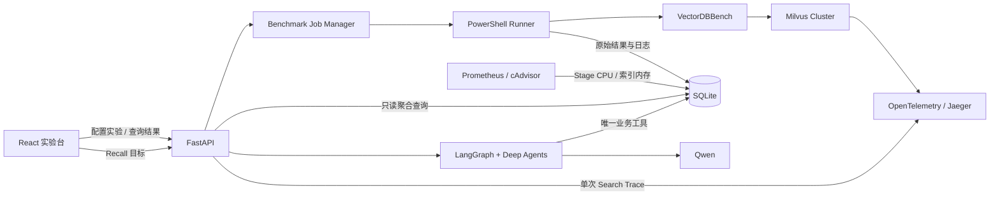

# MilvusTune

一个面向 **Milvus CPU 向量索引**的本地性能实验与调优平台。

它把 VectorDBBench 压测、Prometheus 指标、SQLite 实验数据、参数可视化、
分布式 Trace 和 Recall 调优 Agent 串成一条可重复的实验链路，用于回答：

- 哪一种索引更适合当前数据集和资源环境？
- 参数变化如何影响 Recall、P99、索引内存和构建耗时？
- 达到目标 Recall 时，当前实验中哪组配置更合适？
- 一次 Milvus Search 请求的时间消耗在哪些节点和 Span？

> [在线只读演示](https://123susu.github.io/milvus-lab/)
>
> GitHub Pages 使用公开实验快照，不连接本地 Milvus、SQLite 或大模型接口。

## 项目定位

MilvusTune 是一个学习、实验和性能分析项目，不是生产控制面。

当前环境使用 Docker Compose 部署单机 Milvus `v2.6.21` Cluster。组件按分布式
架构拆分，但每类工作节点只有一个实例，`replica_number=1`，因此实验结果只代表
当前数据集、参数、并发和本机资源条件，不能直接等同于生产容量结论。

## 系统架构



## 核心能力

### 1. 可重复的索引实验

- 在页面配置索引参数矩阵、TopK 和每组重复次数。
- 所有 Benchmark 串行执行，避免多组实验争抢同一套 Milvus 资源。
- 每次原始 Run 独立保留，相同配置按稳定的 `configuration_key` 聚合。
- 聚合结果包含均值、标准差、最小值、最大值和样本数。
- 支持取消任务、查看进度和最近运行日志。

### 2. 多种 Milvus CPU 索引

| 类型 | VectorDBBench command | 主要可调参数 |
|---|---|---|
| HNSW | `milvushnsw` | `M`、`efConstruction`、`efSearch` |
| HNSW_SQ | `milvushnswsq` | HNSW 参数、量化类型、Refine |
| HNSW_PQ | `milvushnswpq` | HNSW 参数、`nbits`、Refine |
| HNSW_PRQ | `milvushnswprq` | HNSW 参数、`nbits`、`nrq`、Refine |
| IVF_FLAT | `milvusivfflat` | `nlist`、`nprobe` |
| IVF_SQ8 | `milvusivfsq8` | `nlist`、`nprobe` |
| AUTOINDEX | `milvusautoindex` | 由 Milvus 自动选择 |
| FLAT | `milvusflat` | 精确检索基线 |

项目中还保留了 VectorDBBench 1.0.22 的其他 Milvus command 配置入口；当前网页
优先开放适合本地 CPU Cluster 的索引。

### 3. 指标采集与 SQLite 数据模型

Benchmark 完成后，采集器将数据写入：

```text
results/vectordbbench/benchmark_metrics.sqlite3
```

主要指标：

| 阶段 | 指标 |
|---|---|
| 数据与索引 | Insert、Optimize、Load duration |
| 检索质量 | Recall、nDCG |
| 检索性能 | Average、P95、P99、QPS |
| 资源 | QueryNode CPU、Vector Index memory |

`benchmark_runs` 保存每次原始实验、完整参数和结果；`concurrency_stage_metrics`
保存每个并发 Stage 的时间窗、延迟、QPS 和 QueryNode CPU。

QueryNode CPU 根据 VectorDBBench 日志中的并发 Stage 开始与结束时间查询
Prometheus；索引内存在本次结果写入 SQLite 前从 Milvus Cluster 即时采集。
监控暂时不可用时，Benchmark 结果仍会保存，缺失指标使用 SQL `NULL`，同时记录错误。

### 4. 参数影响分析

前端提供三种结果视图：

- **索引汇总**：按索引类型查看整体范围。
- **参数明细**：对比同类索引的不同参数组合。
- **原始 Run**：保留每一次实际测量。

参数分析图展示配置变化对 P99、Recall 和 Vector Index 内存的影响，并在同类索引
内部给出 P99、Recall、内存和综合配置建议。综合建议只在当前实验样本中进行
归一化比较，不宣称存在跨环境的绝对最优配置。

### 5. Recall 目标调优 Agent

Agent 使用 **LangGraph + Deep Agents + Qwen**。用户输入 Recall 目标后，它会：

1. 由 LangGraph 前置节点读取 SQLite 聚合历史，并从最近一次 Run 推断当前
   VDBBench Collection 的索引与构建参数；
2. 找出达到目标的配置和最接近目标的未达标配置；
3. 根据结果决定是否调用查询压测，并在每次结果返回后选择下一组搜索参数；
4. 最多串行执行 3 次、并发固定为 1，最终返回推荐配置、实验依据和后续建议。

当前 Agent 只有一个业务工具：

```text
run_benchmark
```

SQLite 读取不暴露给大模型，而是在进入 Agent 前由确定性的 LangGraph 节点完成。
`run_benchmark` 固定 `drop_old=false`、`load=false`，不会重建 Collection 或
重新导入数据；它只允许修改当前索引的搜索参数，例如 HNSW 的 `ef_search` 或
IVF 的 `nprobe`。`M`、`efConstruction`、`nlist` 和量化类型等构建参数保持不变。

默认复用阿里云百炼 OpenAI-compatible API：

```text
model: qwen-plus
api key: DASHSCOPE_API_KEY 环境变量
```

密钥不会写入仓库或发送到前端。

### 6. Milvus 分布式 Trace

项目接入 OpenTelemetry 和 Jaeger。前端可以执行一次真实向量 Search，并将
Client、Proxy、QueryNode、StreamingNode 等服务的 Span 按统一时间轴展示，
用于观察跨节点调用关系和尾延迟来源。

公开站点展示一份本地真实采集的静态 Trace 快照；本地模式调用实际 Cluster。

## 快速开始

### 环境要求

- Windows 10/11 + PowerShell
- Docker Desktop
- Python 3.13
- Node.js `>=22.13.0`

### 1. 安装 Python 依赖

```powershell
py -3.13 -m venv .venv-bench

.\.venv-bench\Scripts\python.exe -m pip install vectordb-bench==1.0.22

.\.venv-bench\Scripts\python.exe -m pip install -r `
  .\benchmark\vectordbbench\api-requirements.txt
```

### 2. 启动 Milvus 与监控

先启动 Docker Desktop，然后在仓库根目录执行：

```powershell
.\deployments\milvus-cluster\start.ps1

docker compose -f .\deployments\monitoring\docker-compose.yml up -d
```

如果已经创建 Attu 容器：

```powershell
docker start attu
```

检查 Cluster：

```powershell
.\deployments\milvus-cluster\status.ps1
```

### 3. 启动 FastAPI

只有使用 Agent 时才需要设置百炼密钥：

```powershell
$env:DASHSCOPE_API_KEY = "<your-api-key>"
```

如需查看 LangGraph、Deep Agent 和 `run_benchmark` 的完整调用链路，可以在后端
启动前开启 LangSmith：

也可以直接修改 `benchmark/vectordbbench/config/langsmith.yml`，配置文件参数会被
环境变量覆盖。

```powershell
$env:MILVUS_LANGSMITH_TRACING = "true"
$env:MILVUS_LANGSMITH_API_KEY = "<your-langsmith-api-key>"
$env:MILVUS_LANGSMITH_PROJECT = "milvus-tune-agent"
```

LangSmith 密钥只保留在后端环境变量中；未开启 tracing 时不会上报。

启动服务：

```powershell
.\.venv-bench\Scripts\python.exe `
  .\benchmark\vectordbbench\benchmark_metrics_api.py
```

API 默认地址为 `http://127.0.0.1:8765`，OpenAPI 文档位于
`http://127.0.0.1:8765/docs`。

### 4. 启动前端

```powershell
Set-Location .\frontend
npm ci
npm run dev
```

打开终端输出的本地地址即可使用实验台。

### 5. 直接运行 VectorDBBench

校验配置但不执行：

```powershell
.\benchmark\vectordbbench\run_benchmark.ps1 `
  -Command milvushnsw `
  -DryRun
```

执行一次 HNSW Benchmark：

```powershell
.\benchmark\vectordbbench\run_benchmark.ps1 `
  -Command milvushnsw
```

运行代表性参数扫描：

```powershell
.\benchmark\vectordbbench\run_representative_index_sweep.ps1
```

参数扫描脚本会串行运行，建议在 Cluster 空闲时执行。

## 本地服务

| 服务 | 地址 |
|---|---|
| Milvus SDK | `http://localhost:19530` |
| Milvus WebUI | `http://localhost:9091/webui/` |
| Attu | `http://localhost:3000` |
| Prometheus | `http://localhost:9090` |
| Grafana | `http://localhost:3001` |
| Jaeger | `http://localhost:16686` |
| FastAPI | `http://127.0.0.1:8765` |

Milvus 默认未启用鉴权，仅适用于本地实验。

## 项目结构

```text
milvus-lab/
├─ benchmark/vectordbbench/       Benchmark 运行器、配置、采集器与 FastAPI
│  ├─ config/                     各类 Milvus 索引配置
│  ├─ metrics/                    SQLite、任务管理、Trace 与调优 Agent
│  └─ tests/                      后端单元测试
├─ deployments/
│  ├─ milvus-cluster/             Milvus 2.6.21 Cluster
│  └─ monitoring/                 Prometheus、Grafana、cAdvisor、Jaeger
├─ frontend/                      React + TypeScript 实验分析页面
├─ docs/                          VectorDBBench 与 Milvus 索引参考
└─ results/                       本地实验结果，默认不提交 Git
```

## 数据与安全边界

- `results/`、数据集、日志和 Python 虚拟环境默认不提交 Git。
- GitHub Pages 只发布静态实验快照，不能触发 Benchmark 或访问本地 API。
- Agent API Key 只从服务端环境变量读取。
- Benchmark 的 `drop_old` 只作用于 VectorDBBench 使用的 `VDBBench` Collection。
- 不要在 Compose `down` 命令中添加 `--volumes`，除非明确要删除持久化数据。

## 验证

后端测试：

```powershell
Set-Location .\benchmark\vectordbbench
..\..\.venv-bench\Scripts\python.exe -m unittest discover -s tests -v
```

前端测试：

```powershell
Set-Location .\frontend
npm test
```

## 进一步阅读

- [本地部署与重启](deployments/README.md)
- [Milvus Cluster 部署细节](deployments/milvus-cluster/README.md)
- [Prometheus 与 Grafana](deployments/monitoring/README.md)
- [VectorDBBench 运行与指标采集](benchmark/vectordbbench/README.md)
- [VectorDBBench Milvus 索引参考](docs/vectordbbench-milvus-reference.md)

## Roadmap

- 增加 Agent 的受控压测工具，让它能够生成下一轮实验计划并在确认后执行。
- 增加跨数据集、TopK、并发和资源规格的实验隔离与对比。
- 增加不同索引间的约束化推荐，例如 Recall 下限、P99 上限和内存预算。
- 将 Trace、Benchmark 和系统指标关联到同一个实验 Run。
